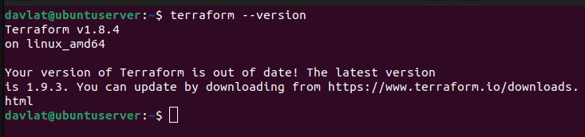
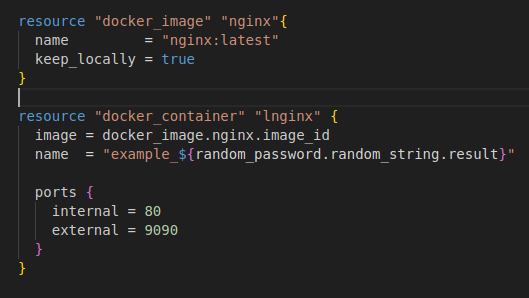
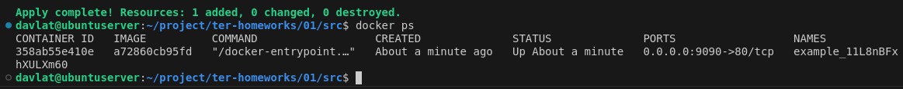

# Домашнее задание к занятию «Введение в Terraform»
### Задание 0
Скриншот решения:  
 

### Задание 1
Решение:  
2. Согласно .gitignore допустимо сохранить личную, секретную информацию в файле personal.auto.tfvars.
3. Cекретное содержимое созданного ресурса random_password "result": "11L8nBFxhXULXm60"
5. Скриншоты исправленного кода и вывод команды docker ps
  

