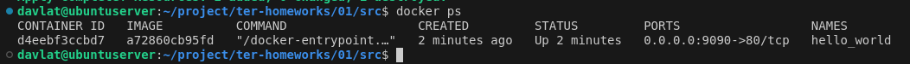
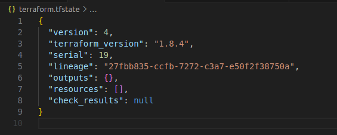
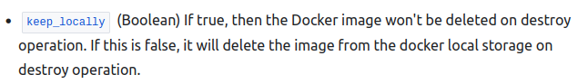

# Домашнее задание к занятию «Введение в Terraform»
### Задание 0
Скриншот решения:  
 

### Задание 1
Решение:  
2. Согласно .gitignore допустимо сохранить личную, секретную информацию в файле personal.auto.tfvars.  
3. Cекретное содержимое созданного ресурса random_password "result": "11L8nBFxhXULXm60"  
5. Скриншоты исправленного кода и вывод команды docker ps  
  
  
6. Применение ключа -auto-approve может привести к непреднамеренному изменению (удалению) ресурса/инфраструктуры. Данный ключ ключ может пригодиться при автоматизации CI/CD.  
  
7. Скриншот содержимого файла terraform.tfstate  
  
8. Docker-образ не был удален из-за установленного параметра keep_locally = true  
  

